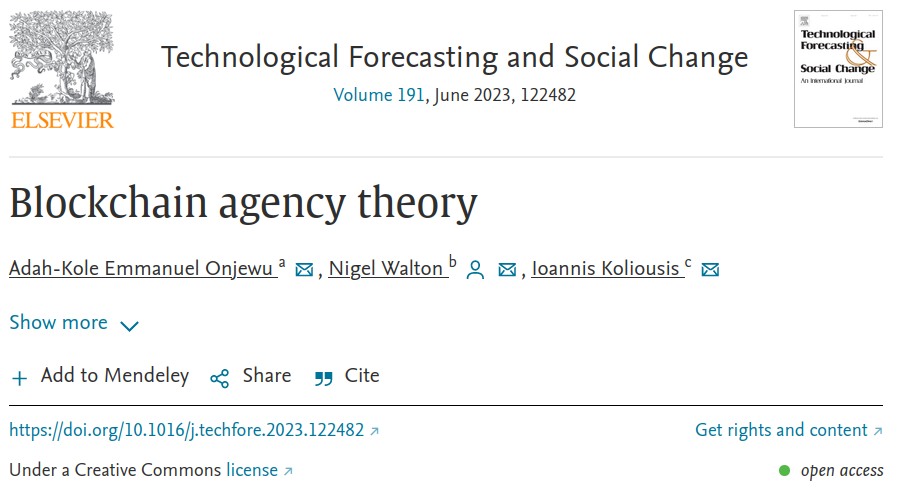

# Agency Theory & "Skin in the game"

## Skin in the game

The phrase "Skin in the game" originated in the 1980s and referred to the amount of an investment owned by a companies' management soliciting outside investment.&#x20;

The more that was owned by management, the equity stake, was seen as an indication of confidence or stability in the investment. A sign that the management were personally invested and therefore had "skin in the game".

## The phrase "Skin in the game"

Hence the phrase "skin in the game" has come to be seen as having a stake or personal investment that motivates decision making or participation.&#x20;

## Principal–agent problem

"Skin in the game" can be a problem when there is an excess of interest or investment that prejudices participation and/or decision-making. This tendency is called the "principal-agent problem".

The influence of those who have a large stake may be obscured resulting in a lack of transparency that disadvantages or manipulates those with smaller stakes.&#x20;

The principal-agent relationship may be between management (agent) and shareholders (principal), or elected officials (agent) and voters (principal), or brokers (agent) and buyers/sellers in a market (principal).

Where there is an asymmetry between agent and principal there will be concerns about moral hazard (exposure to risk) and conflict of interest (corruption).


[Principal-agent problem](https://en.wikipedia.org/wiki/Principal%E2%80%93agent\_problem)


## Blockchain agency theory 

In the context of blockchain technologies the question arises of what is the nature of the principal-agent relationship in permissioned and/or permissionless chains.&#x20;

### Where is Agency in a Blockchain environment ?

Where is agency in an environment that is ideally decentralized ?  Are there still parties (principal) who delegate work to others (agents) ?&#x20;

Governance takes the form of consensus algorithms that ideally regulate blockchain transactions. This permissionless state seeks to dispense with the agent-principal dependency.

Participation in a blockchain ecosystem can be characterized as a kind of strategic alliance between software developers, miners, stakepools, coin holders and other stakeholders that build tools and communities on the infrastructure.

Blockchain agency theory, as outlined in a recent paper, seeks to identify shifts in the principal-agent problem caused by disruptive technologies.&#x20;

<figure><figcaption></figcaption></figure>


**Title:** Blockchain agency theory

**Author:** Adah-Kole Emmanuel Onjewu,Nigel Walton,Ioannis Koliousis

**Publication:** Technological Forecasting and Social Change

**Publisher:** Elsevier

**Date:** June 2023



[Blockchain agency theory](https://www.sciencedirect.com/science/article/pii/S0040162523001671)




## What principal–agent relationships have changed ?

The "Blockchain agency theory" paper identifies 7 assumptions that have informed analysis of the principal-agent problem and pairs these with 7 counter assumptions that may apply to the new blockchain paradigm.&#x20;

Rather than the principal-agent relationship, the interactions in blockchain alliances take a many-to-many dimension and an ecosystem dynamic to co-evolve and co-create value in a mutual sequence.

### 1 - Self-interest / Common Interests

The first assumption of Agency theory is that of self-interest. That agents are inclined to opportunistically reward themselves.&#x20;

Ideally a blockchain will moderate the self-interest of agents seeking to control principal participants. As long as the chain is sufficiently decentralized the common interest of an operational distributed ledger will prevail.&#x20;

The self-interest of both parties is mitigated by an alignment of incentives and interests.

### 2 - Conflicting goals / Congruent goals

The second agency theory assumption is that principals and agents have divergent objectives. For example, agents will seek to maximize their income from their specialized capability and principals seek to maximize their return using the agents capability. These divergent objectives can lead to a reduction in effort by the agent seeking to maximize their income and consequently less return for the principals.&#x20;

Blockchains seek to reconcile these conflicting goals when governance rules are defined in the blockchain design. Members of a blockchain community ideally determine and agree governance of how data and transactions are represented and disputes resolved onchain. This is often framed in terms of common objectives and participation in value creation from stakeholders.&#x20;

Goals are balanced by an alignment of incentives and interests.

### 3 - Bounded rationality / Unbounded rationality

The third agency assumption suggests that parties to a contract have limited or bounded rationality. This leads to a conservative approach to decision making where agents and principals fall back on their contingent knowledge and situation. Agents only do what is satisfactory to meet a contract rather than exploiting all economic outcomes.&#x20;

In contrast, permissionless blockchains are unbounded in the sense of being networks with open data, open source code and accessible information. Ideally this eases bounds on rationality making it possible with AI enhancements to optimize contracts and maximize economic performance.&#x20;

### 4 - Information asymmetry / Information symmetry

The fourth agency theory assumption is that there is an uneven distribution of intelligence between principals and agents. The agents hold more information than principals which inhibits the ability of the principals to monitor whether their interests are being served. The specialized knowledge of agents can act as a barrier to effective supervision and ambiguity in understanding by the principals.

In contrast, the transparency of blockchain ledgers and their algorithmic governance mitigate concerns of information asymmetry through decentralised consensus mechanisms. Members who use a permissionless blockchains maintain an identical copy of the ledger and information consensus is achieved by continuously synchronising all it's copies to ensure accuracy. All activities are traceable and visible across the entire network and can be reconstructed for audit at any time.

### 5 - Pre-eminence of efficiency / Smart contracts

The fifth assumption of agency theory is that ‘principals and agents will choose the most efficient contract’. Consquently any contract is driven by a cost-benefit analysis that seeks the least cost for the highest performance.

<mark style="color:red;">The fifth assumption of agency theory is that ‘principals and agents will choose the most efficient contract’ (</mark>[<mark style="color:red;">Eisenhardt, 1989</mark>](https://www.sciencedirect.com/science/article/pii/S0040162523001671#bb0285)<mark style="color:red;">: 69). This appetite for efficiency stemmed from Frederick W. Taylor’s time studies and scientific management view on the standardisation of work processes as a governance mechanism for improving the performance of individuals and groups (</mark>[<mark style="color:red;">Bendickson et al., 2016</mark>](https://www.sciencedirect.com/science/article/pii/S0040162523001671#bb0105)<mark style="color:red;">). Thus, the contract between principals and agents is guided by a cost-benefit analysis (</mark>[<mark style="color:red;">Droege and Spiller, 2009</mark>](https://www.sciencedirect.com/science/article/pii/S0040162523001671#bb0265)<mark style="color:red;">). Tasks are designed to be accomplished at the least cost or to generate the highest performance at a given cost (</mark>[<mark style="color:red;">Davis, 1985</mark>](https://www.sciencedirect.com/science/article/pii/S0040162523001671#bb0215)<mark style="color:red;">). On one hand, principals are interested in generating greater profits while, on the other hand, workers seek shorter hours, better education, higher compensation and greater quality of life (</mark>[<mark style="color:red;">Bendickson et al., 2016</mark>](https://www.sciencedirect.com/science/article/pii/S0040162523001671#bb0105)<mark style="color:red;">). Ostensibly, standardization in the pursuit of efficiency led to work becoming mundane for workers (</mark>[<mark style="color:red;">Klaw, 1979</mark>](https://www.sciencedirect.com/science/article/pii/S0040162523001671#bb0465)<mark style="color:red;">). The efficiency goals of principals and agents were also at odds and often sparked conflict between principals and agents (</mark>[<mark style="color:red;">Wren and Bedeian, 2020</mark>](https://www.sciencedirect.com/science/article/pii/S0040162523001671#bb0820)<mark style="color:red;">). Reverting to first principles, the prime retraction of the pre-eminence of efficiency assumption is</mark> [<mark style="color:red;">Eisenhardt (1989: 69)</mark>](https://www.sciencedirect.com/science/article/pii/S0040162523001671#bb0285)<mark style="color:red;">'s articulation that ‘efficiency is not directly tested’ in the contractual process. Secondly, ‘efficiency poses a fundamental dilemma to members of the organisation in that it limits the range of human reflection and choice’ (</mark>[<mark style="color:red;">Davis, 1985</mark>](https://www.sciencedirect.com/science/article/pii/S0040162523001671#bb0215)<mark style="color:red;">: 73). In particular, third, efficiency is a reified activity that reduces contracts into a phantom objectivity that conceals the fundamental relationship between people for their execution (</mark>[<mark style="color:red;">Lukács, 1972</mark>](https://www.sciencedirect.com/science/article/pii/S0040162523001671#bb0530)<mark style="color:red;">). To stress this point,</mark> [<mark style="color:red;">Davis (1985: 75)</mark>](https://www.sciencedirect.com/science/article/pii/S0040162523001671#bb0215) <mark style="color:red;">argued that when there is a pre-eminence of efficiency, the ‘dialectical process of understanding totality is lost and is replaced by an experience and a conceptual of mechanical causality’. Accordingly, as opposed to ‘efficient’ contracts that do not reflect the dynamic and human nature of relations between parties, blockchain alliances are governed by smart contracts. To resolve the performance tension between principals and agents, smart contracts are blockchain algorithms that automatically execute parties' agreements when predetermined conditions are met without incurring time loss (</mark>[<mark style="color:red;">Shahab and Allam, 2020</mark>](https://www.sciencedirect.com/science/article/pii/S0040162523001671#bb0690)<mark style="color:red;">). Hence, there is an argument that rather than efficient cost-benefit analyses, smart contracts in blockchain alliances offer a more robust and less contentious basis to assess parties' actual performance, and in real-time too.</mark>

### 6 - Risk aversion / Mean risk

###

### 7 - Information as a commodity / Information availability

## Differences in Blockchain levels and use cases

The "Blockchain Agency Theory" paper does not investigate how different blockchain consensus paradigms, governance practices and use cases may alter the principal-agent relationship.

### Management (agent) and shareholders (principal)

A principal-agent relationship may persist in DAOs with smart contracts ...

### Elected officials (agent) and voters (principal)

Elections run on-chain may require agent intermediaries ...

### Brokers (agent) and buyers/sellers in a market (principal)

Financial instruments or products such as NFTs may require regulation and reporting ...

## Taleb's "Skin in the game"

aa

